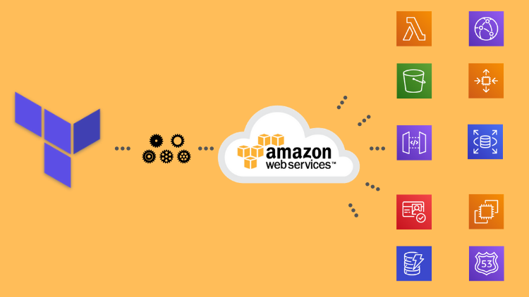

# DevOps: AWS com Terraform Automatizando sua infraestrutura

Arquivos do curso de Terraform publicado na seguintes plataformas:

Curso completo:
- Gumroad: https://bit.ly/3gvOL0x - Preço cheio. Curso atualizado com novos módulos. Possibilidade de mentoria;
- Udemy: https://bit.ly/2JuJmJn - Os maiores descontos. Sem atualizações futuras. Sem mentoria;
- Workover: https://bit.ly/3jPpLDc - Desconto considerável. Possibilidade de mentoria. Sem atualizações futuras.

Este curso irá levá-lo do básico à implementações mais avançadas que lhe permitirão criar aplicações modernas do Terraform envolvendo site estático (AWS S3 / Route53) com certificado SSL (AWS Certificate Manager) e CDN (CloudFront), aplicação auto-escalável (EC2, VPC, Load Balancer, Auto Scaling Group) e aplicação Serverless (AWS Lambda, API Gateway, DynamoDB, Cognito, CloudWatch, SNS).

Para criar uma boa fundação e ser capaz de criar e principalmente entender as aplicações acima, é ensinado os tópicos mais básicos como procurar os recursos na documentação, como utilizar a ajuda do Terraform CLI e toda a base de como é o funcionamento desta ferramenta, como criar um simples recurso, alterá-lo e destruí-lo, variáveis, interpolação, outputs, locals, remote state, built-in functions, data sources, for_each e for, módulos, workspaces e null_resources com provisioners.

Após finalizar o curso o aluno será capaz de escrever scripts Terraform prontos para serem usados em ambientes de produção, pois eles terão toda a fundação e entendimento necessários para implantar os recursos utilizando as melhores práticas do mercado tanto para uma rápida prototipação e uma manutenção tranquila e confiável.

No curso você encontrará muito código que poderá ser reaproveitável para aplicar diretamente na sua própria infraestrutura da AWS, além de um módulo totalmente funcional para criar buckets e arquivos dentro do AWS S3.

### O que você irá aprender
- Será capaz de automatizar a criação e manutenção da infraestrutura de suas aplicações na AWS
- Aprender conceitos básicos e avançados como módulos, interpolação, arquivos de estado do Terraform
- Criar um site estático com React utilizando AWS S3, Cloudfront, certificado SSL e domínio personalizado
- Criar um aplicação auto-escalável com VPC, Internet Gateway, Subnets, Security Groups, EC2, Load Balancer e Auto Scaling Group
- Criar uma aplicação serverless utilizando AWS Lambda, DynamoDB, API Gateway, SNS e Cognito

### Pré requisitos

- Noções básicas de programação
- Para conseguir rodar os scripts é necessário ter uma conta na AWS, que pode ser criado de graça, porém é preciso ter um cartão de crédito internacional.

### Para quem é o curso

- Quem quer aprender Terraform e automatizar o processo de criação e manutenção da infraestrutura de suas aplicações.
- É Dev, Sys Admin, DevOps ou Simpatizantes e quer aprender sobre automação usando Terraform.
